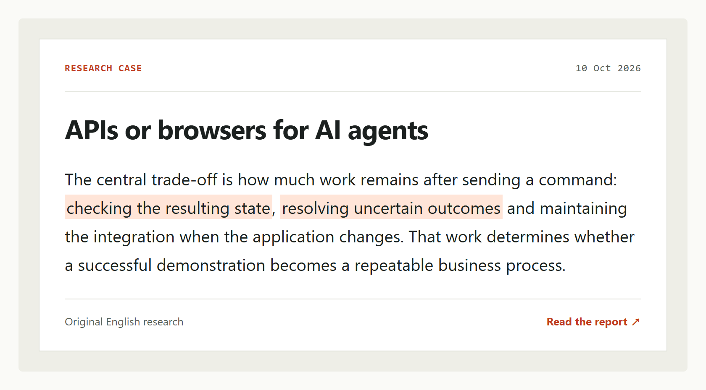
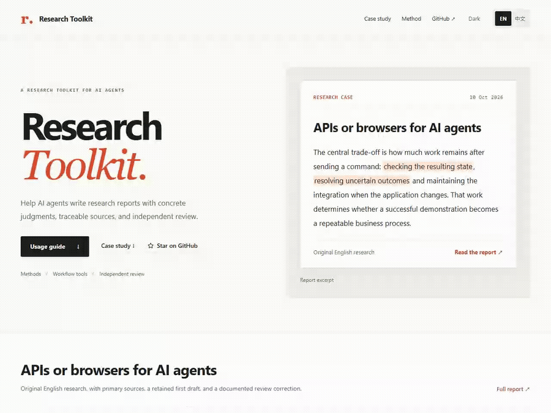

# Research Toolkit

[](./LICENSE) [](https://github.com/rrrrrredy/research-toolkit/actions/workflows/framework-checks.yml)

[English](./README.md) · [简体中文](./README.zh-CN.md)

**Help AI agents write research reports with concrete judgments, traceable sources, and explicit review choices.**

Research methods · Callable workflow tools · Review choices. For industry research, product comparisons, company analysis, and technical research.

[**Quick start**](#quick-start) · [Use with your agent](#usage) · [Research case](#research-case) · [Evaluation results](#evaluation-results) · [Lite quickstart](./docs/quickstart-lite.md) · [Documentation](#documentation)

## Quick start

**Start with `lite`.** Allow about **5–15 minutes** with your agent ready to use. Copy this request; the topic and two fictional sources are supplied:

```text
Use https://github.com/rrrrrredy/research-toolkit and read SKILL.md.
Choose profile=lite. Read examples/lite/start.en.json for the brief
and examples/lite/sources.md for the source notes.
Recommend a helpdesk plan for the six-person team in 350–500 English
words. Use only the supplied evidence, register sources and claims,
and draft section by section. Skip research_review and Full delivery
gates; complete all six Lite checklist items with concrete evidence.
Return the short report, separate source/claim records, and checklist.
Disclose the fictional evidence and absence of independent review.
```

You receive a **short report + sources/claims trail + final checklist**. The time is an estimate, not a model response guarantee. No plugin or MCP setup is required; if your agent cannot open GitHub, provide the [downloaded files or text](./agents/README.md#use-without-installation).

[Full Lite walkthrough](./docs/quickstart-lite.md) · [Choose your agent](./agents/README.md#choose-your-tool) · [Example files](./examples/lite/README.md)

Found a problem? [Submit a failure case](https://github.com/rrrrrredy/research-toolkit/issues/new?template=failure-case.yml)—a report excerpt and its source material are a useful first contribution. [Other small contributions](./CONTRIBUTING.md#good-first-issue-ideas).

## Use as an MCP server

For callable tools, install Python 3.10+ and the MCP dependency in the Python environment your client uses:

```bash
git clone https://github.com/rrrrrredy/research-toolkit.git
cd research-toolkit
python -m pip install -r requirements-mcp.txt
```

**Claude Desktop / Cursor:** merge this JSON into Claude Desktop's `claude_desktop_config.json` (Settings → Developer → Edit Config) or Cursor's `.cursor/mcp.json`. Replace both absolute paths. Keep research tasks outside the checkout.

```json
{
  "mcpServers": {
    "research-toolkit": {
      "type": "stdio",
      "command": "python",
      "args": ["/absolute/path/to/research-toolkit/scripts/research_mcp.py"],
      "env": {
        "RESEARCH_TOOLKIT_WORKSPACE": "/absolute/path/to/research-tasks"
      }
    }
  }
}
```

**Codex CLI / IDE:** its native configuration is TOML, not `mcpServers` JSON. Add the equivalent to `~/.codex/config.toml`:

```toml
[mcp_servers.research-toolkit]
command = "python"
args = ["/absolute/path/to/research-toolkit/scripts/research_mcp.py"]

[mcp_servers.research-toolkit.env]
RESEARCH_TOOLKIT_WORKSPACE = "/absolute/path/to/research-tasks"
```

Restart the client and confirm the six `research_*` tools appear. If `python` is not on the client's PATH, use the absolute executable path shown by `python -c "import sys; print(sys.executable)"`. Windows JSON paths can use forward slashes. [Client documentation and troubleshooting](./docs/usage-modes.md#connect-mcp-separately).

**A captured Full example with self-review.** Lite skips review; this small fictional Full task demonstrates the review call without an external account. The agent supplies the report and evidence files between guidance and review.

| Call | Input excerpt | Actual response excerpt |
| --- | --- | --- |
| `research_start` | `{"task":"shipment-note","profile":"full","brief":…}` ([complete input](./examples/mcp/start.json)) | `{"ready_for_collection":true,"profile":"full","missing_fields":[],"stage":"collect"}` |
| `research_guide` | `{"stage":"draft","language":"en","profile":"full"}` | `{"stage":"draft","profile":"full"}`; method text omitted |
| `research_review` | `{"task":"shipment-note","evidence_paths":["source.md"],"reviewer":"self"}` | `{"reviews_complete":false,"action_required":"self_review","reviewer":"self","review_strength":"degraded"}` |
| `research_review` again | Submit the [self-review](./examples/mcp/self-review.json) plus the returned `input_version` | `{"reviews_complete":true,"reviewer":"self","review_strength":"degraded"}` |
| `research_finish` | `{"task":"shipment-note","message":"The fictional shipment note is complete, with self-review only and no independent review."}` | `{"completed":true}` |

[Captured inputs/outputs](./examples/mcp/captured.json) · [Run the example](./examples/mcp/README.md). These are local server responses, not efficacy results; the example replays a supplied author review and makes no external model call.

**MCP demo recording:** pending. [GIF/asciinema recording slot and instructions](./docs/assets/mcp-demo.md).

## Research case

<a href="https://github.com/rrrrrredy/research-toolkit/blob/main/docs/case-study/api-or-browser/report.md">
<picture>
  <source media="(prefers-color-scheme: dark) and (max-width: 600px)" srcset="./docs/assets/api-browser-case.en.mobile.dark.png">
  <source media="(max-width: 600px)" srcset="./docs/assets/api-browser-case.en.mobile.png">
  <source media="(prefers-color-scheme: dark)" srcset="./docs/assets/api-browser-case.en.dark.png">
  
</picture>
</a>

[**Full report**](./docs/case-study/api-or-browser/report.md) · [Initial draft](./docs/case-study/api-or-browser/initial.md) · [Sources](./docs/case-study/api-or-browser/sources.md) · [Reviews and revision](./docs/case-study/api-or-browser/reviews.md)

**APIs or browsers: how to choose an execution route for an AI agent.** Written in English from 11 primary English sources, this report compares supported APIs, DOM automation, and visual interaction through completion, retries, permissions, recovery, and cost.

<details open>
<summary><strong>New API coverage does not settle the migration decision</strong></summary>

**Initial draft**

> There is no benefit in preserving this split if the API later covers document generation with adequate permissions and result checking.

**Final report**

> If the API later covers document generation with adequate permissions and result checking, the original coverage gap disappears. Retiring the browser step then depends on whether the expected maintenance and recovery savings justify migration and revalidation costs.

The independent review identified a missing counterexample: an existing browser step can remain worthwhile when replacing and revalidating it costs more than the expected savings. The author accepted the finding and qualified the recommendation.

[Full passages and reasoning](https://rrrrrredy.github.io/research-toolkit/?lang=en&case=migration&detail=reason#case) · [Original review and decision](./docs/case-study/api-or-browser/reviews.md#migration-costs)

</details>

Public-source analysis, 10 October 2026. The workflow is illustrative; no deployment or comparative performance experiment was conducted. This case does not establish a general Toolkit quality advantage. [Evaluation status](./docs/evaluation-status.md)

<details>
<summary>Case walkthrough</summary>

[](./docs/assets/api-browser-walkthrough.en.mp4)

[Video](./docs/assets/api-browser-walkthrough.en.mp4) · [Interactive case](https://rrrrrredy.github.io/research-toolkit/?lang=en&case=migration#case)

</details>

## Usage

[**5–15 minute Lite quickstart**](./docs/quickstart-lite.md): copy one complete request, use two supplied sources, and produce a short brief with the final checklist. No reviewer setup.

Start with the shared [research instructions in SKILL.md](./SKILL.md). Your agent reads that entry point and follows its links to the methods needed at each stage. Native Skill installation is optional.

Send this request to an agent that can read GitHub and access the required sources:

```text
Use Research Toolkit for this task:
https://github.com/rrrrrredy/research-toolkit

Read SKILL.md first, then follow its links to the methods needed
for each research stage.

My research request: [Describe your research question, intended
use, and desired output.]

Use the conversation to clarify essential gaps and establish the
brief and outline before collecting sources. Follow the selected
profile's research, writing, review, and delivery instructions.
```

Replace the bracketed text with your research request. Include any known audience, scope, length, time cutoff, or required sources.

[Setup for your agent](./agents/README.md#choose-your-tool) covers tool-specific installation and file access.

| Your agent's capabilities | How to provide the toolkit |
| --- | --- |
| Can read GitHub | Send the repository link and research request above. |
| Can read local files or attachments | [Download the repository](https://github.com/rrrrrredy/research-toolkit/archive/refs/heads/main.zip), provide `SKILL.md`, and make the reference files available as needed. |
| Accepts text only | Paste the full `SKILL.md` and the reference sections needed for the task. See [chat-only use](./agents/README.md#chat-only-use). |
| Supports native Skills | Install a complete toolkit copy through the host's supported Skill mechanism. See [agent setup](./agents/README.md). |
| Small research task | Use `research_start(profile="lite")` or CLI `start --profile lite`: retain the brief, claims, section drafting and checklist; skip review and full delivery hard gates. |

**Optional workflow tools.** An agent that can start a local MCP server can use the six tools for task records, stage guidance, review calls, and delivery checks. A compatible plugin bundles the same methods and tools. [Plugin and MCP configuration](./docs/usage-modes.md)

Reading the instructions does not start MCP or execute a review. Full returns a self-review prompt when no backend is configured; configure any supported backend for external or independent opinions. [Backend setup and data destinations](./SKILL.md#reviewer-backends)

## Review and Acceptance

| Tier | Setup and trade-off |
| --- | --- |
| `self` | Zero configuration; role switch in the author context, recorded as degraded self-review. |
| `external` | One command or endpoint; retain the structured review and original response. |
| `independent` | Separate contexts; preserve existing version binding, recovery and task-required auditing. |

Without a configured backend, review falls back to self; declared independent requirements are never silently downgraded, and Lite skips review. [Configuration checks and backends](./docs/usage-modes.md#reviewer-backends) explain data destinations, account usage and recovery.

## Inside the toolkit

| Component | What it provides |
| --- | --- |
| **Research methods** | Scope, source assessment, judgments, analysis, writing, and revision, loaded by your agent by stage. |
| **Workflow tools** | Task creation, saved progress, method loading, review calls, and delivery checks. |
| **Independent review** | A non-author context examines the whole report and evidence; findings and revision decisions are retained. |

Your agent performs retrieval, reading, analysis, and writing with its own capabilities. The plugin bundles the Skill, methods, and local MCP server. The Skill and MCP can also be used separately.

<details>
<summary>The six MCP tools</summary>

| Tool | Function |
| --- | --- |
| `research_start` | Create a task and check the brief and review configuration. |
| `research_status` | Read and save progress; check source and claim records for stage transitions. |
| `research_guide` | Load the methods for the current stage. |
| `research_review` | Bind the report and evidence, run reviews, and retain replies or failures. |
| `research_finish` | Check the current report, unresolved requirements, reviews, and delivery text. |
| `research_check_reviewer` | Inspect backend configuration, dependencies and supported local login probes without model calls. |

[Tools and execution boundaries](./docs/usage-modes.md#what-happens-during-a-task)

</details>

## Evaluation Suite

<a id="evaluation-results"></a>

**The public archive includes with/without-toolkit development comparisons and a fixed-source Lite pilot. They expose workflow and report weaknesses; they do not establish a general quality advantage.**

| Experiment groups | Control design | Blind-review scope and limits | Core conclusion |
| --- | --- | --- | --- |
| [2 public development pairs](./evals/diagnostics/2026-09-07/calibration-provenance.json), 4 original reports | With/without toolkit; toolkit first in both tasks | Development diagnostics and later repair reviews; no blinded efficacy result | Useful evidence alongside weaknesses in conclusion priority, reader navigation and evidence use. |
| [11 retained historical families](./docs/evaluation-status.md), 22 review inputs | Historical paired study; author failures retained, supplemental runs separate | Private aggregates; public material does not establish blinded execution | Primary view: both arms had necessary defects in 5 families; 6 were unresolved. Useful for development feedback. |
| [5 shared task families × 4 author models](./evals/studies/2026-10-10-lite-four-models/README.md) | Same-model, same-brief fixed sources; seeded run order and A/B labels | One label-masked LLM judge per usable pair; report clues and execution failures retained | Format and time limits left most primary pairs unresolved; supplemental judgments are separate. |
| [23 synthetic bad/control pairs](./evals/semantic_diagnostics/) | Short failure-mode excerpts, not complete report comparisons | [Available model diagnoses](./evals/semantic_diagnostics/reviews/2026-09-08/) retain missed defects and disagreements | They locate review weaknesses and support regression work, not toolkit efficacy. |

**Evidence boundary:** public run records do not establish that each pair in the first two collections used the same model and brief, or fully document blinded dimensions and condition masking. Later repair reviews knew the author’s thesis. No toolkit win rate is reported here. The original 7 research tasks are in Chinese; the 23 synthetic diagnostics include 18 Chinese and 5 English pairs. This remains limited coverage, and the English showcase is not an additional controlled pair.

Detailed reports: [public reports and repairs](./evals/diagnostics/2026-09-07/) · [evaluation evidence and version boundaries](./docs/evaluation-status.md) · [evaluation standard](./docs/report-evaluation-standard.md).

Reproduce the public two-pair inventory without model calls:

```bash
python scripts/reproduce_calibration.py
```

The [reproduction script](./scripts/reproduce_calibration.py) checks the frozen public bundle and all four original report hashes, then writes `evals/runs/calibration-reproduction/inventory.json` and `inventory.md`. Use a new `--output` directory to repeat it. This reproduces an archive inventory, not historical model generations or a quality score. [The existing conformance runner](./scripts/run_evals.py) checks task artifacts separately ([command and outputs](./evals/README.md#run-an-eval)).

[The four-model Lite pilot](./evals/studies/2026-10-10-lite-four-models/README.md) publishes all 40 first author attempts across five shared task families, with raw responses, failures and judgments. [Protocol and harness](./docs/eval-protocol.md). This fixed-source, instruction-only pilot does not validate Full or MCP, and does not change the historical n=2, unblinded, toolkit-first limitations.

The historical inventory is dated September 21, 2026: one of the original 12 families was excluded after results were known; 12 of 22 original author attempts failed and supplemental reports did not replace those failures. Public files are a subset of the privately retained materials. Software checks and historical studies do not validate the current workflow's general research quality.

[Submit a failure case](https://github.com/rrrrrredy/research-toolkit/issues/new?template=failure-case.yml) to help expand the known-bad regression cases.

## Documentation

| Topic | Entry |
| --- | --- |
| Research methods, writing standards, and full instructions | [Research guide](./docs/research-guide.md) · [Stage methods](./references/) |
| Plugin, Skill, MCP, and agent setup | [Usage and configuration](./docs/usage-modes.md) · [Agent setup](./agents/README.md) |
| Reports, sources, and real revisions | [Case archive](./docs/case-study/api-or-browser/README.md) |
| Evaluation materials, defects, and evidence limits | [Evaluation suite](./evals/README.md) · [Evaluation status](./docs/evaluation-status.md) |
| Development, contributions, and releases | [Contributing](./CONTRIBUTING.md) · [Changelog](./CHANGELOG.md) |

[All documentation](./docs/README.md) · [Research instructions](./SKILL.md) · [Website](https://rrrrrredy.github.io/research-toolkit/)

Contribute research questions, usage feedback, or failure cases through [Issues](https://github.com/rrrrrredy/research-toolkit/issues/new), and improve methods and tools through [pull requests](https://github.com/rrrrrredy/research-toolkit/compare).
