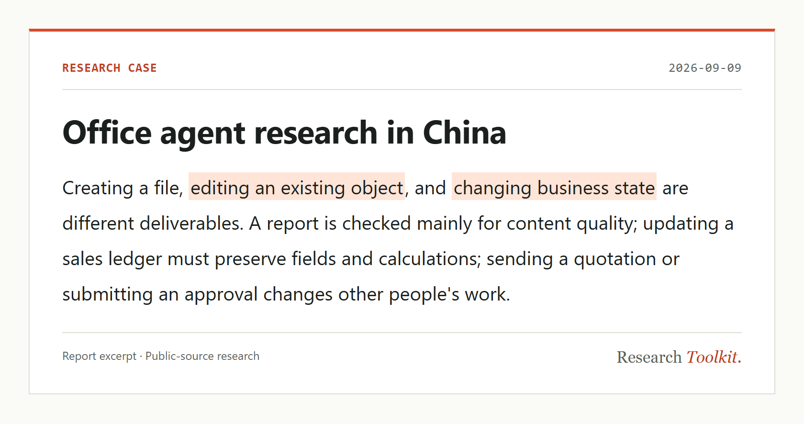
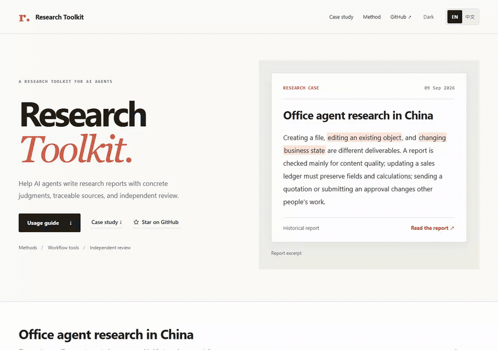

# Research Toolkit

[](./LICENSE) [](https://github.com/rrrrrredy/research-toolkit/actions/workflows/framework-checks.yml)

[English](./README.md) · [简体中文](./README.zh-CN.md)

**Help AI agents write research reports with concrete judgments, traceable sources, and independent review.**

Research methods · Callable workflow tools · Independent review. For industry research, product comparisons, company analysis, and technical research.

[**Use with your agent**](#usage) · [Research case](#research-case) · [Documentation](#documentation)

## Research case

<a href="https://github.com/rrrrrredy/research-toolkit/blob/main/docs/case-study/report.en.md">
<picture>
  <source media="(prefers-color-scheme: dark) and (max-width: 600px)" srcset="./docs/assets/repository-case.en.mobile.dark.png">
  <source media="(max-width: 600px)" srcset="./docs/assets/repository-case.en.mobile.png">
  <source media="(prefers-color-scheme: dark)" srcset="./docs/assets/repository-case.en.dark.png">
  
</picture>
</a>

[**Full report**](./docs/case-study/report.en.md) · [Initial draft (Chinese)](./docs/case-study/office-agents/original.zh-CN.md) · [Final report (Chinese)](./docs/case-study/office-agents/revised.zh-CN.md) · [Sources and reviews](./docs/case-study/office-agents/README.md)

This report compares Kimi Work, Coze, Feishu / Doubao Work, Wukong, WPS, and WorkBuddy. Four real revisions cover prose, structure, product relationships, and model supply. The excerpts below are translated from the retained Chinese manuscripts.

<details open>
<summary><strong>Direct prose: replace a value claim with an action</strong></summary>

**Initial draft**

> The value of independent office agents lies not in moving a chat box onto the desktop, but in bringing materials, execution, and revisions into one stretch of work.

**Final report**

> Independent office agents organize materials, execution, and revisions in one workspace.

Shorten the opening and replace the vague closing about different implementations with specific criteria: tools, context, and device availability. Keep the conditional benefit of less file handling and the operating limits.

[Full passages and reasoning](https://rrrrrredy.github.io/research-toolkit/?lang=en&case=writing&detail=reason#case) · [Review decisions (Chinese)](./docs/case-study/office-agents/reviews.md)

</details>

<details>
<summary><strong>Process narration: remove an outline announcement, retain the scope</strong></summary>

**Initial draft**

> The following sections cover work objects, independent workspaces, office suites, desktop execution, and commercialization. The evidence consists of public product documents and examples, without installed-product testing; a single use record does not represent industry performance.

**Final opening**

> The research uses public documents and examples, without installed-product testing. Some dynamic descriptions were checked on September 10; their capabilities are not attributed retrospectively to earlier versions.

Delete the outline announcement and the sentence announcing three judgments. Keep source, testing, and sample limits in the opening. This is deletion and reorganization; the excerpts occupy different positions in the report.

[Passage locations and reasoning](https://rrrrrredy.github.io/research-toolkit/?lang=en&case=process&detail=reason#case)

</details>

<details>
<summary><strong>aily and Doubao Work: narrow a product-lineage inference</strong></summary>

**Initial excerpt**

> This is evidence of continuity between the current product description and the earlier feature direction

**Final excerpt**

> The two points in time show product directions in object operations and organizational-context collaboration; they do not establish version inheritance between aily and Doubao Work

The dated sources describe each product direction. They do not establish version inheritance or feature migration. Retain the capability descriptions and migration caveat; lack of evidence for inheritance does not establish that inheritance is absent.

[Sources, changes, and review decisions](https://rrrrrredy.github.io/research-toolkit/?lang=en&case=versions&detail=review#case)

</details>

<details>
<summary><strong>Coze's models: distinguish execution frameworks from model supply</strong></summary>

**Initial excerpt**

> Coze brings native agents, third-party agents hosted in the cloud, and local connections into one collaboration interface.

**Added in the final report**

> Third-party cloud mode runs execution frameworks such as Claude Code and Codex CLI on Coze cloud computers, using models supplied by Coze rather than being tied to the original provider’s account and model.

The draft already described execution modes and permission boundaries. The revision adds native-model choices and third-party cloud-model supply. In this deployment, a framework name does not identify the model; supplied by Coze does not mean developed by Coze.

[Full passages, sources, and reasoning](https://rrrrrredy.github.io/research-toolkit/?lang=en&case=analysis&detail=reason#case)

</details>

Historical report: information through September 9, 2026; some dynamic documents checked on September 10. Public-source research without installed-product testing. These versions are not a controlled with/without-toolkit experiment. [Evaluation status](./docs/evaluation-status.md)

<details>
<summary>Case walkthrough</summary>

[](./docs/assets/case-walkthrough.mp4)

[Video](./docs/assets/case-walkthrough.mp4) · [Interactive case](https://rrrrrredy.github.io/research-toolkit/?lang=en&case=writing#case)

</details>

## Usage

Use the research methods with your agent. Provide the repository link, upload the files, or paste the instructions; native Skill installation is optional.

Send this request to an agent that can read GitHub and access the required sources:

```text
Use Research Toolkit for this task:
https://github.com/rrrrrredy/research-toolkit

Research office agents available to users in China in 2026.
Compare Kimi Work, Coze, Feishu / Doubao Work, Wukong,
WPS, and WorkBuddy. Write for AI product and workplace leads.

Explain which files and business objects each product changes,
where tasks run, and how models, tools, context, permissions,
and human involvement affect delivery and rework.

Use information available as of [DATE]. Cite important claims.
Distinguish company statements, media experiences, and measured
outcomes. Explain what could overturn your conclusions.

Read SKILL.md. Clarify missing requirements and agree on an
outline before collecting sources.
```

Replace `[DATE]` and adapt the topic and audience. This request is based on the archived case brief; a new run may reach different conclusions.

| Your agent's capabilities | How to provide the toolkit |
| --- | --- |
| Can read GitHub | Send the repository link and research request above. |
| Can read local files or attachments | [Download the repository](https://github.com/rrrrrredy/research-toolkit/archive/refs/heads/main.zip), provide `SKILL.md`, and make the reference files available as needed. |
| Accepts text only | Paste the full `SKILL.md` and the reference sections needed for the task. See [chat-only use](./agents/README.md#chat-only-use). |
| Supports native Skills | Install a complete toolkit copy through the host's supported Skill mechanism. See [agent setup](./agents/README.md). |

**Optional workflow tools.** An agent that can start a local MCP server can use the five tools for task records, stage guidance, review calls, and delivery checks. A compatible plugin bundles the same methods and tools. [Plugin and MCP configuration](./docs/usage-modes.md)

Reading the instructions does not start MCP or run an independent review. Retrieval, file access, and tool execution depend on the host. Independent review needs a separate reviewer with access to the report and evidence. The MCP reviewer defaults to a signed-in Codex CLI and also accepts a configured review command; this does not require the author agent to be Codex. [Reviewer configuration and accounts](./docs/usage-modes.md#review-accounts-and-recovery)

## Inside the toolkit

| Component | What it provides |
| --- | --- |
| **Research methods** | Scope, source assessment, judgments, analysis, writing, and revision, loaded by your agent by stage. |
| **Workflow tools** | Task creation, saved progress, method loading, review calls, and delivery checks. |
| **Independent review** | A non-author context examines the whole report and evidence; findings and revision decisions are retained. |

Your agent performs retrieval, reading, analysis, and writing with its own capabilities. The plugin bundles the Skill, methods, and local MCP server. The Skill and MCP can also be used separately.

<details>
<summary>The five MCP tools</summary>

| Tool | Function |
| --- | --- |
| `research_start` | Create a task and check the brief and review configuration. |
| `research_status` | Read and save progress; check source and claim records for stage transitions. |
| `research_guide` | Load the methods for the current stage. |
| `research_review` | Bind the report and evidence, run reviews, and retain replies or failures. |
| `research_finish` | Check the current report, unresolved requirements, reviews, and delivery text. |

[Tools and execution boundaries](./docs/usage-modes.md#what-happens-during-a-task)

</details>

## Documentation

| Topic | Entry |
| --- | --- |
| Research methods, writing standards, and full instructions | [Research guide](./docs/research-guide.md) · [Stage methods](./references/) |
| Plugin, Skill, MCP, and agent setup | [Usage and configuration](./docs/usage-modes.md) · [Agent setup](./agents/README.md) |
| Reports, sources, and real revisions | [Case archive](./docs/case-study/office-agents/README.md) |
| Evaluation materials, defects, and evidence limits | [Evaluation suite](./evals/README.md) · [Evaluation status](./docs/evaluation-status.md) |
| Development, contributions, and releases | [Contributing](./CONTRIBUTING.md) · [Changelog](./CHANGELOG.md) |

[All documentation](./docs/README.md) · [Research instructions](./SKILL.md) · [Website](https://rrrrrredy.github.io/research-toolkit/)

Contribute research questions, usage feedback, or failure cases through [Issues](https://github.com/rrrrrredy/research-toolkit/issues/new), and improve methods and tools through [pull requests](https://github.com/rrrrrredy/research-toolkit/compare).
