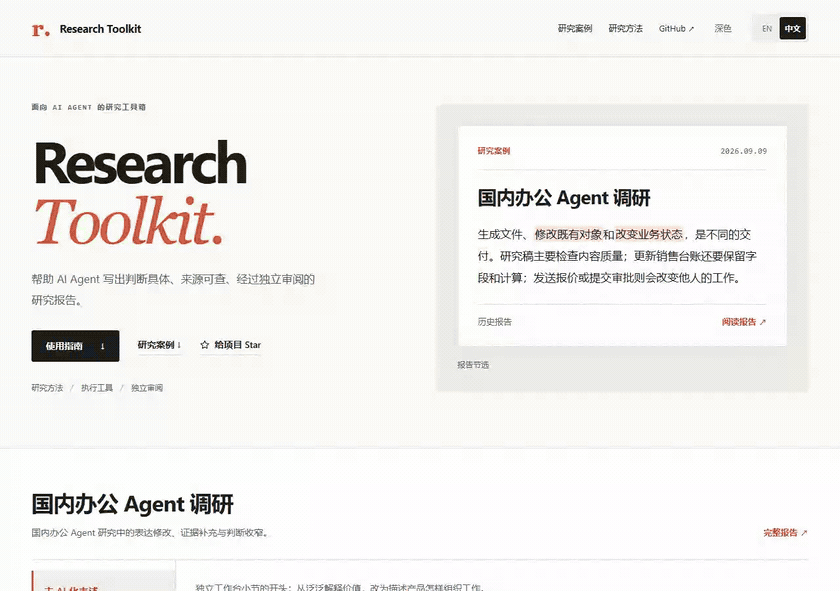

# Research Toolkit

[](./LICENSE) [](https://github.com/rrrrrredy/research-toolkit/actions/workflows/framework-checks.yml)

[English](./README.md) · [简体中文](./README.zh-CN.md)

**让 AI Agent 写出判断具体、来源可查的研究报告，并按任务选择评审档位。**

研究方法 · 可调用的执行工具 · 可选评审档位。适用于行业研究、产品比较、公司分析和技术调研。

[**评测结果 →**](#evaluation-results) · 2 组开发阶段的公开对照，尚不能证明普遍质量优势。

[**快速开始**](#快速开始) · [在你的 Agent 中使用](#使用) · [研究案例](#研究案例) · [Lite 入门](./docs/quickstart-lite.zh-CN.md) · [文档](#文档)

## 快速开始

**首次使用建议选择 `lite`。** Agent 已就绪时，预计约 **5–15 分钟**。复制下面的请求即可，题目和两份虚构来源已经备好：

```text
使用 https://github.com/rrrrrredy/research-toolkit，先读 SKILL.md。
选择 profile=lite。完整需求见 examples/lite/start.zh.json，
来源说明见 examples/lite/sources.zh-CN.md。
为需求中的六人团队推荐客服工具，写一篇600–900字中文简报。
只用随附材料，登记来源与判断，分节起草。
跳过 research_review 和 Full 交付硬门槛；
逐项完成 Lite 的六项 checklist，并给出具体依据。
分别交付简报、来源与判断记录、checklist。
披露材料虚构且未进行独立评审。
```

你会得到 **短报告 + sources/claims 记录 + 最终 checklist**。用时是估计值，不是模型响应时长保证。无需配置插件或 MCP；Agent 无法打开 GitHub 时，提供[下载后的文件或文本](./agents/README.zh-CN.md#直接读取使用)。

[完整 Lite 入门](./docs/quickstart-lite.zh-CN.md) · [选择你的 Agent](./agents/README.zh-CN.md#选择工具) · [示例文件](./examples/lite/README.zh-CN.md)

遇到问题？[提交失败案例](https://github.com/rrrrrredy/research-toolkit/issues/new?template=failure-case.yml)，提供报告片段及来源材料，就能参与贡献。[其他适合首次参与的小任务](./CONTRIBUTING.zh-CN.md#适合首次贡献的小任务)。

## 作为 MCP 服务使用

需要可调用工具时，安装 Python 3.10+，并在客户端实际使用的 Python 环境中安装 MCP 依赖：

```bash
git clone https://github.com/rrrrrredy/research-toolkit.git
cd research-toolkit
python -m pip install -r requirements-mcp.txt
```

**Claude Desktop / Cursor：**将下面的 JSON 合入 Claude Desktop 的 `claude_desktop_config.json`（Settings → Developer → Edit Config）或 Cursor 的 `.cursor/mcp.json`。替换两处绝对路径，研究任务目录放在仓库之外。

```json
{
  "mcpServers": {
    "research-toolkit": {
      "type": "stdio",
      "command": "python",
      "args": ["/absolute/path/to/research-toolkit/scripts/research_mcp.py"],
      "env": {
        "RESEARCH_TOOLKIT_WORKSPACE": "/absolute/path/to/research-tasks"
      }
    }
  }
}
```

**Codex CLI / IDE：**其原生配置采用 TOML，不采用 `mcpServers` JSON。将等效配置加入 `~/.codex/config.toml`：

```toml
[mcp_servers.research-toolkit]
command = "python"
args = ["/absolute/path/to/research-toolkit/scripts/research_mcp.py"]

[mcp_servers.research-toolkit.env]
RESEARCH_TOOLKIT_WORKSPACE = "/absolute/path/to/research-tasks"
```

重启客户端，确认能看到六个 `research_*` 工具。若客户端 PATH 中找不到 `python`，使用 `python -c "import sys; print(sys.executable)"` 显示的绝对路径；Windows JSON 路径可用正斜杠。[客户端文档与排查方法](./docs/usage-modes.zh-CN.md#单独接入-mcp)。

**实际采集的 Full 自评示例。** Lite 跳过评审；这个小型虚构 Full 任务展示无需外部账户的评审调用。Agent 在读取方法后、评审前保存报告和证据文件。

| 调用 | 输入节选 | 实际返回节选 |
| --- | --- | --- |
| `research_start` | `{"task":"shipment-note","profile":"full","brief":…}`（[完整输入](./examples/mcp/start.json)） | `{"ready_for_collection":true,"profile":"full","missing_fields":[],"stage":"collect"}` |
| `research_guide` | `{"stage":"draft","language":"en","profile":"full"}` | `{"stage":"draft","profile":"full"}`；省略方法正文 |
| `research_review` | `{"task":"shipment-note","evidence_paths":["source.md"],"reviewer":"self"}` | `{"reviews_complete":false,"action_required":"self_review","reviewer":"self","review_strength":"degraded"}` |
| 再次 `research_review` | 提交[自评内容](./examples/mcp/self-review.json)和返回的 `input_version` | `{"reviews_complete":true,"reviewer":"self","review_strength":"degraded"}` |
| `research_finish` | `{"task":"shipment-note","message":"The fictional shipment note is complete, with self-review only and no independent review."}` | `{"completed":true}` |

[采集的输入与输出](./examples/mcp/captured.json) · [运行示例](./examples/mcp/README.zh-CN.md)。这些是本地服务的真实返回，不是效果评测结果；示例重放已提供的作者自评，不调用外部模型。

**MCP 演示录屏：**待录制。[GIF/asciinema 占位与录制说明](./docs/assets/mcp-demo.zh-CN.md)。

## 研究案例

<a href="https://github.com/rrrrrredy/research-toolkit/blob/main/docs/case-study/report.zh-CN.md">
<picture>
  <source media="(prefers-color-scheme: dark) and (max-width: 600px)" srcset="./docs/assets/repository-case.zh-CN.mobile.dark.png">
  <source media="(max-width: 600px)" srcset="./docs/assets/repository-case.zh-CN.mobile.png">
  <source media="(prefers-color-scheme: dark)" srcset="./docs/assets/repository-case.zh-CN.dark.png">
  
</picture>
</a>

[**完整报告（中文原文）**](./docs/case-study/report.zh-CN.md) · [初稿](./docs/case-study/office-agents/original.zh-CN.md) · [定稿](./docs/case-study/office-agents/revised.zh-CN.md) · [来源与审阅记录](./docs/case-study/office-agents/README.md)

这份报告比较 Kimi Work、扣子、飞书／豆包工作、悟空、WPS 和 WorkBuddy。四处真实修改，涵盖表达、结构、产品关系和模型信息：

<details open>
<summary><strong>去 AI 化表述：把价值铺垫改成具体动作</strong></summary>

**初稿**

> 独立办公Agent的价值，不在于把聊天框搬到桌面，而在于把资料、执行与修改放进同一段工作。

**定稿**

> 独立办公Agent把资料、执行与修改组织在同一工作空间。

缩短开头，并把段末泛泛的“实现方式不同”展开为谁提供工具、谁保存上下文、谁维持设备在线。可能减少文件搬运的判断和运行限制仍保留。

[完整段落与修改理由](https://rrrrrredy.github.io/research-toolkit/?lang=zh&case=writing&detail=reason#case) · [审阅取舍](./docs/case-study/office-agents/reviews.md#去-ai-化表述中间稿与作者编辑记录)

</details>

<details>
<summary><strong>去过程痕迹：删除章节预告，保留研究边界</strong></summary>

**初稿**

> 以下按工作对象、独立工作台、办公套件、桌面执行与商业化展开。依据是公开产品文档和案例，不含安装实测；单一使用记录不代表行业表现。

**定稿开篇**

> 依据公开文档和案例，不含安装实测；部分动态说明于9月10日核对，不倒推为早期版本的能力。

删除“以下按……展开”和“有三个判断值得先说清楚”。必要的来源、实测和案例代表性说明集中到开篇。这里展示的是删除与重排，两段位于稿件的不同位置。

[段落位置与修改理由](https://rrrrrredy.github.io/research-toolkit/?lang=zh&case=process&detail=reason#case)

</details>

<details>
<summary><strong>aily 与豆包工作：收窄版本继承的推断</strong></summary>

**初稿节选**

> 这是当前产品说明与此前功能路线的接续证据

**定稿节选**

> 两个时间点分别展示对象操作和组织上下文协作的产品方向，不足以证明aily与豆包工作的版本继承

两份不同时期的资料可以各自说明产品方向，无法据此认定版本继承或功能迁移。保留各自的能力描述与迁移限制；未证明继承，也不等于证明没有继承。

[来源、差异与审阅取舍](https://rrrrrredy.github.io/research-toolkit/?lang=zh&case=versions&detail=review#case)

</details>

<details>
<summary><strong>扣子用什么模型：区分执行框架与模型供应</strong></summary>

**初稿节选**

> 扣子把原生Agent、托管在云端的第三方Agent和本地接入放在同一协作入口。

**定稿新增**

> 第三方云端模式则在扣子云电脑运行[…]等执行框架，接入扣子提供的模型，不绑定原厂账号与模型。

初稿已区分运行方式与权限；定稿补充原生模型选项和第三方云端的模型供应方式。在这个部署场景中，框架名称不能直接说明底层模型，“扣子提供”也不等于“扣子自研”。

[完整段落、来源与修改理由](https://rrrrrredy.github.io/research-toolkit/?lang=zh&case=analysis&detail=reason#case)

</details>

这是一份历史报告：信息截至 2026 年 9 月 9 日，部分动态文档于 9 月 10 日核对；基于公开资料，未安装实测。稿件变化不构成有无工具箱的对照实验。[评测现状](./docs/evaluation-status.zh-CN.md)

<details>
<summary>案例浏览演示</summary>

[](./docs/assets/case-walkthrough.zh-CN.mp4)

[视频](./docs/assets/case-walkthrough.zh-CN.mp4) · [交互案例](https://rrrrrredy.github.io/research-toolkit/?lang=zh&case=writing#case)

</details>

## 使用

[**5–15 分钟 Lite 入门**](./docs/quickstart-lite.zh-CN.md)：复制一个完整请求，用两份随附材料产出简报和最终 checklist，无需配置评审后端。

通用入口是 [SKILL.md 中的研究指令](./SKILL.md)，也可阅读[中文版本](./SKILL.zh-CN.md)。Agent 读取入口后，按研究阶段加载它链接的具体方法。原生 Skill 安装是可选方式。

将以下请求发给能够读取 GitHub 并访问所需来源的 Agent：

```text
本次研究请使用 Research Toolkit：
https://github.com/rrrrrredy/research-toolkit

先阅读 SKILL.md，再按研究阶段读取它链接的参考方法。

我的研究需求：[填写研究问题、用途和希望得到的成果。]

结合已有信息澄清关键缺口，明确需求和提纲后再搜集资料，
并按选定档位完成研究、写作、评审与交付。
```

将方括号内容替换为你的研究需求；已明确的读者、范围、篇幅、信息截止日或必需材料也可一并提供。

[不同 Agent 的接入说明](./agents/README.zh-CN.md#选择工具)介绍各工具的安装与文件读取方式。

| Agent 的能力 | 提供工具箱的方法 |
| --- | --- |
| 能读取 GitHub | 发送上面的仓库链接和研究请求。 |
| 能读取本地文件或附件 | [下载仓库](https://github.com/rrrrrredy/research-toolkit/archive/refs/heads/main.zip)，提供 `SKILL.md`，并按任务需要提供参考文件。 |
| 只能接收文本 | 粘贴完整 `SKILL.md` 及任务需要的参考章节。见[纯聊天使用边界](./agents/README.zh-CN.md#只能在聊天中使用时)。 |
| 支持原生 Skill | 通过该工具支持的技能机制安装完整副本。见[Agent 接入](./agents/README.zh-CN.md)。 |
| 小型研究任务 | `research_start(profile="lite")` 或 CLI `start --profile lite`：保留 brief、claim、分段起草与 checklist，跳过评审和完整交付硬门槛。 |

**可选执行工具。** 能启动本地 MCP 服务的 Agent，可调用六个工具保存任务、加载阶段方法、执行审阅和检查交付。兼容的插件将同一套方法与工具一起安装。[插件与 MCP 配置](./docs/usage-modes.zh-CN.md)

读取指令不会自动启动 MCP 或执行评审。Full 未配置评审后端时返回 self 评审模板；需要外部／独立意见时配置任一受支持后端。[后端配置与材料去向](./SKILL.zh-CN.md#评审后端)

## 评审与验收

| 档位 | 配置与取舍 |
| --- | --- |
| `self` | 零配置，同上下文切换角色；记录标明自评与强度降级。 |
| `external` | 一个外部命令或端点；保留结构化评审及原始响应。 |
| `independent` | 独立上下文；保留既有版本绑定、恢复及任务要求的审计。 |

未配置后端时自动使用 self，已声明的独立评审不能被静默降级；Lite 不运行评审。[配置自查与后端](./docs/usage-modes.zh-CN.md#reviewer-backends)说明材料去向、账户用量和故障处理。

## 工具箱组成

| 组成 | 提供什么 |
| --- | --- |
| **研究方法** | 明确需求、评估来源、形成判断、展开分析、写作和修订；由 Agent 按阶段读取。 |
| **执行工具** | 创建任务、保存进度、加载方法、调用审阅和检查交付条件。 |
| **独立审阅** | 在非作者上下文中检查完整报告及其证据，保留意见与修改取舍。 |

Agent 使用自身的检索、读写和分析能力完成研究。插件将 Skill、方法和本地 MCP 打包在一起；也可以单独使用 Skill 或连接 MCP。

<details>
<summary>六个 MCP 工具</summary>

| 工具 | 功能 |
| --- | --- |
| `research_start` | 建立研究任务，检查需求与审阅配置。 |
| `research_status` | 读取和保存进度，检查阶段所需的来源与主张记录。 |
| `research_guide` | 按阶段加载研究方法。 |
| `research_review` | 绑定稿件与证据，执行审阅并保留回复或失败。 |
| `research_finish` | 检查当前稿件、未解决要求、审阅与交付文本。 |
| `research_check_reviewer` | 本地检查后端配置、依赖与可探测的登录状态，不调用模型。 |

[工具与执行边界](./docs/usage-modes.zh-CN.md#一次研究如何推进)

</details>

## 评测集

<a id="evaluation-results"></a>

**做过对照：公开归档保留了 2 组用／不用工具箱的开发期比较。实验暴露了导航不足、结论主次不清、自评偏宽等问题，尚不能证明普遍的质量优势。**

| 实验组数 | 对照设计 | 盲评维度与边界 | 核心结论 |
| --- | --- | --- | --- |
| [2 组公开开发对照](./evals/diagnostics/2026-09-07/calibration-provenance.json)，4 份原始报告 | 使用／不使用工具箱；两题均先运行工具箱组 | 开发诊断与后续修稿评审；未建立盲评效果结论 | 报告提供了可用证据，也暴露出结论排序、读者导航和证据使用问题。 |
| [11 个保留的历史任务族](./docs/evaluation-status.zh-CN.md)，22 份评审输入 | 历史配对研究；保留作者失败，补跑另列 | 私人汇总记录；公开材料不足以复核盲评执行 | 主视图中 5 族两组都有必要缺陷、6 族未决；适合开发反馈。 |
| [23 组合成反例／对照](./evals/semantic_diagnostics/) | 针对特定缺陷的短片段，不是完整报告对照 | [已有模型诊断](./evals/semantic_diagnostics/reviews/2026-09-08/)保留漏检与分歧 | 可定位评审弱点并做回归，不能据此推断工具箱效力。 |

**证据边界**：公开运行记录尚不足以核实前两类研究中，每一对报告是否使用相同模型与 brief，也未完整记录盲评维度和条件隐藏方式；后续修稿评审知道作者的论点。这里不报告工具箱获胜率。7 个研究任务均为中文；23 组合成诊断包含 18 组中文和 5 组英文，覆盖面仍有限。英文展示案例也不是新增对照实验。

详细报告：[公开原稿与修订稿](./evals/diagnostics/2026-09-07/) · [评测证据与版本边界](./docs/evaluation-status.zh-CN.md) · [评测标准](./docs/report-evaluation-standard.zh-CN.md)。

历史汇总截至 2026 年 9 月 21 日：最初 12 组中有 1 组在结果已知后被排除；22 次原始作者尝试中有 12 次失败，补充报告没有替换这些失败。公开文件只是私人保留材料的一部分。软件检查与历史研究不能证明当前流程具有普遍的研究质量优势。

[提交失败案例](https://github.com/rrrrrredy/research-toolkit/issues/new?template=failure-case.yml)，帮助补充已知失败的回归案例。

## 文档

| 内容 | 入口 |
| --- | --- |
| 研究方法、写作标准与完整说明 | [研究指南](./docs/research-guide.zh-CN.md) · [按阶段的方法](./references/) |
| 插件、Skill、MCP 与 Agent 接入 | [使用与配置](./docs/usage-modes.zh-CN.md) · [Agent 接入](./agents/README.zh-CN.md) |
| 报告、来源与真实改稿 | [案例档案](./docs/case-study/office-agents/README.md) |
| 评测材料、已知缺陷与证据范围 | [评测集](./evals/README.zh-CN.md) · [评测现状](./docs/evaluation-status.zh-CN.md) |
| 开发、贡献与版本变化 | [贡献指南](./CONTRIBUTING.zh-CN.md) · [更新记录](./CHANGELOG.zh-CN.md) |

[全部文档](./docs/README.zh-CN.md) · [研究指令](./SKILL.zh-CN.md) · [网站](https://rrrrrredy.github.io/research-toolkit/?lang=zh)

欢迎通过 [Issues](https://github.com/rrrrrredy/research-toolkit/issues/new) 提交研究需求、使用反馈或失败案例，通过 [Pull requests](https://github.com/rrrrrredy/research-toolkit/compare) 改进方法和工具。
