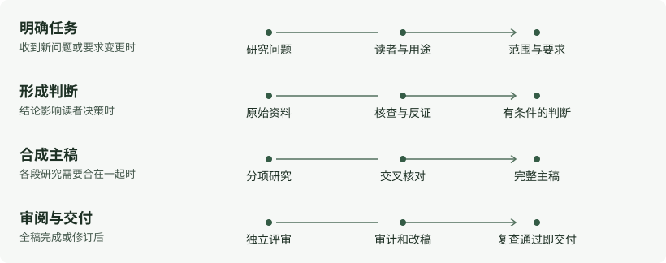

# Research Toolkit

[](./LICENSE) [](https://github.com/rrrrrredy/research-toolkit/actions/workflows/framework-checks.yml)

[English](./README.md) · [简体中文](./README.zh-CN.md)

**从研究问题或已有材料出发，完成中英文长研究与写作，交付判断具体、来源可查的报告。**

可以从零研究，对照来源修订现稿，或随新证据更新判断。适用于行业、公司、技术、政策和科学等领域。

微短剧报告初稿用应用端增长来说明已有观众正在改变观看入口。审阅发现两组数据的时期和统计口径不同，成稿把渠道迁移保留为一种可能解释。[在线阅读案例](https://rrrrrredy.github.io/research-toolkit/index.zh-CN.html#case) · [查看原始修订](./evals/studies/2026-11-09-long-research/reports/microdrama_market_zh/analysis/change-note-full-01.md)

[**快速开始**](#快速开始) · [选哪一种](#选哪一种) · [研究案例](#研究案例) · [文档](#文档)

## 快速开始

选一条请求复制给 Agent，补上已经确定的信息。如果它打不开仓库链接，就附上或粘贴 `SKILL.md` 和本次需要的参考文件。直接读取研究方法无需安装 Skill、Python 或 MCP。

<a id="使用"></a>

### 提出研究需求

```text
使用 Research Toolkit（https://github.com/rrrrrredy/research-toolkit），先读 SKILL.md。
请研究[问题]，或按[修改要求]修订随附初稿。
报告给[读者]用于[用途]。请使用随附来源，并遵循我给出的范围、截止日期或篇幅要求。
交付一份引用可查的完整报告。修订已有稿件时，附简要变化说明。
```

### 只审阅现稿

```text
使用 Research Toolkit（https://github.com/rrrrrredy/research-toolkit），先读 SKILL.md。
请用独立于作者的上下文审阅随附初稿，对照任务要求和可用来源，保留原稿。
对每个影响报告使用的问题，给出原文位置、证据、影响和最小修改建议。
```

可以把初稿交给未参与起草的新会话。Toolkit 已包含审阅方法。如需单独安装审阅技能，可用 [Research Review](https://github.com/rrrrrredy/research-review/blob/main/README.zh-CN.md)。

### 安装后重复使用

[下载精简发布包](https://github.com/rrrrrredy/research-toolkit/releases/latest)，[核对校验和并解压](./docs/installation-versioning.zh-CN.md#install-a-version-pinned-skill)。按 [Codex](./agents/codex.zh-CN.md#安装)、[Claude Code](./agents/claude.zh-CN.md#安装) 或[其他 Agent](./agents/README.zh-CN.md#选择工具) 的指南安装，再重新打开项目。在 Codex 的 `/skills` 里选中项目内的 `research-toolkit` 技能，在 Claude Code 中调用 `/research-toolkit`。

需要保存任务状态或检查交付条件时，见[可选的本地工具配置](./docs/quickstart.zh-CN.md#安装本地工具可选)。

## 一项研究怎样完成？

主 Agent 把握研究问题、当前有效要求和整体判断。研究子 Agent 承担调查、比较、计算及实质写作；指定的统稿 Agent 阅读完整成果和来源，理顺论证，逐步形成一份主稿。独立 Agent 分别审阅、审计和复查。当前报告通过复查后，由主 Agent 交付完整成果。

| 职责 | 工作怎样连接 |
| --- | --- |
| 任务与上下文 | 共同保留需求、提纲、有效要求及实际依赖；已满足但仍约束后续工作的要求继续可见。 |
| 证据与分析 | 每位研究者取得有边界的问题、相关原始材料和已有判断，交接依据、推理、条件及未决问题。 |
| 成稿与修订 | 按有意义的研究单元推进，先审阅后续分析所依赖的关键前提；完整分析进入明确负责人的主稿，变化返回受影响单元与提纲。 |
| 审阅与交付 | <!-- current-review -->三个独立的非作者评审组覆盖七个内容视角。<!-- /current-review -->按需加领域专审。Agent 完成审计、必要修改和独立复查后交付成稿。 |

这四项是相互连接的职责，不是四个固定 Agent 或四套流程。Codex、Claude Code 等工具负责启动 Agent 和传递消息；Toolkit 提供共同输入、方法、成果关联和完成检查。Agent 工具内的原生协作无需另配 API。 如需脚本执行，使用同一套 [Agent 执行适配器](docs/usage-modes.zh-CN.md#agent-host-execution)，连接你正在使用的 Claude Code、OpenCode 或 Codex。[研究步骤](docs/conduct-research.zh-CN.md#从零研究的步骤) · [交接与实际调用](docs/usage-modes.zh-CN.md#研究委派与成果交接)



| 工作方式 | 谁负责串起研究过程 | 可回看的记录 |
| --- | --- | --- |
| 直接用一个 Agent | 同一会话负责查证、写稿和修改 | 宿主保留的对话和文件 |
| 交给多个 Agent 并行查 | 主 Agent 或宿主负责汇总、处理分歧 | 各自的输出及宿主保存的派工记录 |
| 用 Toolkit 的本地工作流 | 主 Agent 组织研究，独立评审、审计和最终复查各有分工 | 一份稿件对应的来源、裁定、修订及交付回执 |

## 选哪一种？

**Skill 提供研究方法，CLI 和 MCP 调用同一套本地工具，插件把 Skill 与 MCP 打包安装。** 根据 Agent 环境和任务状态保存需要选择入口，各入口使用相同的研究与写作方法。

| 你的情况 | 用什么、装什么 | 怎样开始 |
| --- | --- | --- |
| 希望已有 Agent 按方法完成研究 | **Skill**：直接读取研究方法，或安装后重复使用。方法本身不依赖 Python 或 MCP；首次使用默认关闭使用记录。 | 发送[研究请求](#使用)，让 Agent 按需读取方法，用已有能力检索、分析和写作。 |
| 希望方法与任务工具一起接入，Agent 工具支持插件 | **插件**：一次安装包含 Skill 和 MCP；本地工具需要 Python 3.10+ 及 MCP 依赖。 | 按[插件说明](./docs/usage-modes.zh-CN.md#安装插件)安装，重开会话、选用 Toolkit 后提出研究需求。 |
| 需要保存任务状态、恢复工作、关联来源和稿件，Agent 工具支持本地 MCP | **MCP**：配置本地服务；方法仍读同一份 Skill。已有插件时不必重复配置。 | 按[MCP 配置](./docs/usage-modes.zh-CN.md#单独接入-mcp)接入，由 Agent 调用 `research_*` 工具。 |
| 在终端或脚本中工作，或 Agent 工具没有 MCP | **CLI**：下载仓库，使用 Python 3.10+；无需 MCP 依赖。 | Agent 读取同一份 Skill，用[命令行](./docs/usage-modes.zh-CN.md#只用-skill或使用-cli)调用相同的任务工具。 |

第一次使用可直接从 Skill 开始。是否启用任务工具，取决于是否需要持久状态、工具化评审和交付检查，不取决于报告字数；无需把四种方式全部安装或依次使用。只用 Skill 也能完成深度长文，不默认维护工具所需的 CSV、JSONL 或交付回执。

**适合什么任务？** 需要多来源分析、比较、解释或有依据建议的中英文多领域长研究，包括长文内的摘要与局部论证、已有稿修订，以及新证据到来后的接续。单一事实查询、普通翻译或简单润色通常直接使用已有 Agent 即可。材料由 Agent 使用已有检索与访问能力获取并阅读。

[从零做一项研究](./docs/conduct-research.zh-CN.md#从零研究的步骤) · [修订或更新已有报告](./docs/conduct-research.zh-CN.md#修订或更新已有报告) · [按所用工具安装](./agents/README.zh-CN.md#选择工具) · [安装固定版本的 Skill](./docs/installation-versioning.zh-CN.md#install-a-version-pinned-skill)

**首次使用会做什么？** 可以直接读研究方法。使用记录默认关闭。接入任务工具后，Agent 可以按宿主能提供的并发名额排队，自行审计、改稿和复查，通过独立复查后直接交付成稿。见[使用数据设置](./docs/usage-data.zh-CN.md)和[自动审阅和改稿](./docs/review-completion.zh-CN.md#自动运行审阅和改稿)。

## 研究案例

在[国内办公 Agent 案例](docs/case-study/office-agents-2026-11/README.md)可以从首稿一路查看来源、评审与成稿。[欧盟 GPAI 实录](docs/case-study/v3-review/README.zh-CN.md)展示在两个并发名额下如何把 39 条意见归为 17 项裁定，修订后由独立 Agent 复查并直接交付。[评测结果与限制](docs/evaluation-status.zh-CN.md)列出样本和历史上没有观察到提升的对照。

**中国微短剧市场：增长结构、平台竞争与产业链价值分配。** 从观看人口、应用活跃和广告变现的不同口径出发，解释平台为什么形成不同经营模式，以及流量、版权、合同和现金承担如何影响各方收益。正文包含平台比较、价值流向和可复算的经营情景。资料截至 **2026 年 11 月 9 日**。

[**在线阅读全文**](https://rrrrrredy.github.io/research-toolkit/case-study/long-research-2026-11/microdrama.zh-CN.html) · [同题英文研究](https://rrrrrredy.github.io/research-toolkit/case-study/long-research-2026-11/microdrama.en.html) · [首稿、来源与独立审阅](./evals/studies/2026-11-09-long-research/reports/microdrama_market_zh/README.md)

另一篇新案例是 **Test-Time Compute**：比较采样、搜索、修订、验证及工具反馈，解释增加计算何时改善结果、何时该改变计算用途。包含方法与证据矩阵、预算分配算例和设计决策树。

[**英文全文**](https://rrrrrredy.github.io/research-toolkit/case-study/long-research-2026-11/test-time-compute.en.html) · [同题中文研究](https://rrrrrredy.github.io/research-toolkit/case-study/long-research-2026-11/test-time-compute.zh-CN.html)

两组中英文报告分别基于各题的冻结材料独立撰写，同题另一语言稿不作为作者输入。[本次 benchmark](./evals/studies/2026-11-09-long-research/README.zh-CN.md) 包含 13 个独立问题、15 份报告，保留首次输出、具体缺陷及修订。此前的办公 Agent、API／浏览器及报告更新案例仍在[历史档案](https://rrrrrredy.github.io/research-toolkit/case-study/index.zh-CN.html)。

<a id="作为-mcp-服务使用"></a>
<a id="评审与验收"></a>
<a id="工具箱组成"></a>

## Agent 接入

| 使用方式 | 入口 |
| --- | --- |
| 直接读取方法 | 复制[上方请求](#使用)。使用附件或纯文本时，见 [Agent 接入说明](./agents/README.zh-CN.md#直接读取使用)。 |
| 安装 Skill 或插件 | [选择你的 Agent](./agents/README.zh-CN.md#选择工具) · [插件安装](./docs/usage-modes.zh-CN.md#安装插件) |
| 保存进度并调用执行工具 | [MCP 安装与客户端配置](./docs/usage-modes.zh-CN.md#单独接入-mcp) · [CLI](./docs/usage-modes.zh-CN.md#只用-skill或使用-cli) |
| 体验本地工具 | [可运行的 MCP 示例与实际返回](./examples/mcp/README.zh-CN.md)；合成示例说明接口，真实运行记录保留实际审阅范围。 |

九个本地工具提供共同任务上下文、按需方法、来源与分析成果保存、已登记版本日志查询、评审与交付检查。CLI 与 MCP 使用相同实现。MCP 需要 Python 3.10+ 和能启动本地进程的客户端；安装指南覆盖 Windows、macOS 和 Linux。

独立审阅使用 Agent 工具的新上下文。三个评审组覆盖七项视角，审计和最终复查分别交给独立上下文。CLI／MCP 通过 `research_review` 保存原始回复和对应输入版本。[审阅与验收](./docs/review-completion.zh-CN.md)

<a id="评测集"></a>
<a id="evaluation-results"></a>

## 证据与评测

公开记录保留完整报告、原始失败、评审和修订结果。案例展示具体正文修正，模型对照对应记录中的任务与条件，软件检查覆盖实际测试的流程行为。向更广范围比较 Toolkit 与原生 Agent 的质量或效率，需要研究任务、输入、模型和执行条件可比。

[当前证据与边界](./docs/evaluation-status.zh-CN.md) · [完整报告版本比较](./evals/studies/2026-10-13-before-after/README.zh-CN.md) · [数据集与检查](./evals/README.zh-CN.md) · [历史数据归档](https://github.com/rrrrrredy/agent-trajectory-data/blob/main/docs/PUBLIC-EVALUATIONS.zh-CN.md)

## 文档

| 需要什么 | 入口 |
| --- | --- |
| 研究与写作方法 | [研究指南](./docs/research-guide.zh-CN.md) · [Skill 指令](./SKILL.zh-CN.md) |
| 委派研究与整合成果 | [协作说明与调用](./docs/usage-modes.zh-CN.md#研究委派与成果交接) · [实质研究与交接](./references/subagents-and-review-loop.zh-CN.md#实质研究与交接) |
| 修订报告与更新资料 | [接续已有研究](./docs/usage-modes.zh-CN.md#接续已有研究) |
| 安装与配置 | [Agent 接入](./agents/README.zh-CN.md) · [使用指南](./docs/usage-modes.zh-CN.md) |
| 开发与版本变化 | [贡献指南](./CONTRIBUTING.zh-CN.md) · [更新记录](./CHANGELOG.zh-CN.md) |

[全部文档](./docs/README.zh-CN.md) · [网站](https://rrrrrredy.github.io/research-toolkit/?lang=zh) · [提交失败案例](https://github.com/rrrrrredy/research-toolkit/issues/new?template=failure-case.yml)
